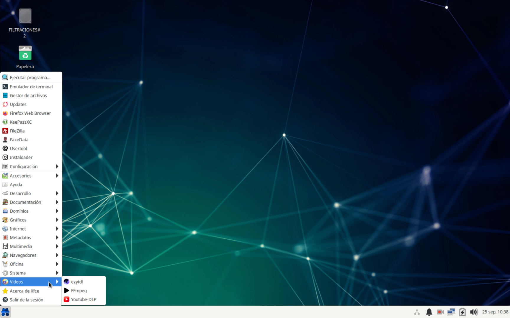
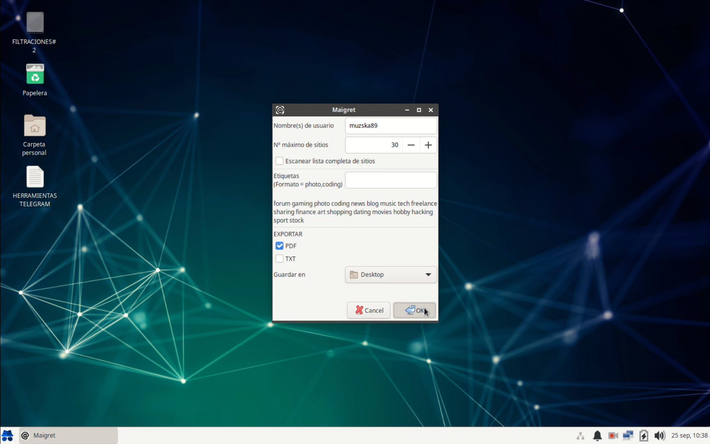

# InteliOS

ISO personalizada de Xubuntu para realizar OSINT.  
Inspirado por los scripts de Michael Bazzell, llevarlos un paso más allá y crear unas GUI más completas usando [yad](https://github.com/v1cont/yad).

# Herramientas incluidas
- Updates: Script para actualizar el sistema y el resto de herramientas
- KeePassXC
- Navegador Firefox: utiliza Whoogle-Search por defecto, posee varios complementos para OSINT, así como múltiples marcadores de utilidad. También tiene un User-Agent de Windows que se puede cambiar modificando la variable `general.useragent.override` en `about:config`.
- [Whoogle](https://github.com/benbusby/whoogle-search): Frontend de Google que limita la recolección de datos por parte de la compañía.
- Navegador TOR
- FileZilla
- [FakeDataGen](https://github.com/JoelGMSec/FakeDataGen): Crea datos falsos ESPAÑOLES: nombre, correo, provincia...; y los almacena en un archivo.
- [Maigret](https://github.com/soxoj/maigret)
- [Sherlock](https://github.com/sherlock-project/sherlock)
- [Holehe](https://github.com/megadose/holehe)
- [SocialScan](https://github.com/iojw/socialscan)
- [yt-dlp](https://github.com/yt-dlp/yt-dlp)
- [ffmpeg](https://github.com/FFmpeg/FFmpeg)
- [ezytdl](https://github.com/sylviiu/ezytdl)
- [instaloader](https://github.com/instaloader/instaloader)
- [Amass](https://github.com/owasp-amass/amass)
- [theHarvester](https://github.com/laramies/theHarvester)
- [exiftool](https://github.com/exiftool/exiftool)
- [Mediainfo-GUI](https://mediaarea.net/en/MediaInfo)
- [Joplin](https://github.com/jgraph/drawio-desktop)
- [Draw.io]()
- [gnumeric](https://github.com/GNOME/gnumeric)

## Utilidades de consola
- [FacebookChecker](https://github.com/yasserjanah/FacebookChecker): Muestra parcialmente el correo electrónico y número de teléfono de un usuario. mPara usarlo, escribe: `FacebookChecker -id <facebook_id>

- [user_agent](https://github.com/TechfaneTechnologies/user_agent): Muestra una lista actualizada de agentes de usuario. `get_user_agent`

- `update-firefox`: Dado que tuve que eliminar snap del sistema, usa este script en su lugar para actualizar el navegador. Simplemente escríbelo en la consola.

## Actualizar Joplin y Draw.io
Estas aplicaciones están gestionadas por el programa [AM](https://github.com/ivan-hc/AM-Application-Manager). Para actualizarlos, hay que ejecutar el comando `am -u`. De todas maneras, está contenido en el script Updates.

# Instalación
## Descargar ISO
Descarga directamente la iso desde [aquí](https://mega.nz/file/F3E0iZqZ#bH5Q7X5Gz6whfarmXTl07yG7tOsd392HPrlj0jzpOtI)  

Flashéala en un pendrive o una máquina virtual.

## Crear ISO con CUBIC
**IMPORTANTE**: Este programa sólo funciona en Ubuntu.  
Clona el repositorio.  
`git clone github.com/triboremen/InteliOS`

Descarga una imagen de Xubuntu desde [aquí](https://xubuntu.org/download/).  
Crea una nueva carpeta (Ej: Cubic-InteliOS) y guarda ahí la iso de Xubuntu.  

Descarga Cubic.  
`sudo apt-add-repository universe`  
`sudo apt-add-repository ppa:cubic-wizard/release`  
`sudo apt update`  
`sudo apt install --no-install-recommends cubic`  

Abre Cubic y selecciona la carpeta que creaste anteriormente.  
En el siguiente menú selecciona la imagen de Xubuntu y rellena el resto de campos cómo prefieras.  
Una vez termine de prepararse el entorno, arrastra la carpeta del repositorio a la consola de Cubic y acepta la copia.  
Ejecuta el script para crear la iso de InteliOS:  
`cd InteliOS`  
`./Instalacion.sh`  
Cuando termine, dale a "Next" hasta que prepare la ISO. Una vez terminado el proceso, en la carpeta del proyecto tendrás la imagen ISO lista para flashear en un pendrive o en una máquina virtual. 

# Ubicación de los archivos importantes
Los scripts de las GUI están en `/opt/OSINT-Scripts`.  
Las utilidades de consola están en `/usr/bin`.  
Buena parte de las herramientas están escritas en Python. Éstas están contenidas en entornos virtuales, ubicados en `/virtualenvs`.  
Los iconos de las herramientas están en `/usr/share/OSINT-Icons`.  
Todos los accesos directos están almacenados en `/usr/share/applications`.  
El navegador TOR se encuentra en `$HOME/tor-browser` o `/etc/skel/tor-browser`.  

# ¿Por qué?
El PC que usaba antes se me rompió y me vi obligado a utilizar uno de bajas prestaciones que no podía manejar máquinas virtuales.  
Como sabía que tardaría en conseguir un buen ordenador, si quería seguir haciendo OSINT la única manera que tenía era creando una iso customizada.  

# Licencias
Este proyecto está cubierto por la licencia MIT.  
Todos los iconos utilizados en este proyecto se han obtenido de [flaticon.com](flaticon.com)
